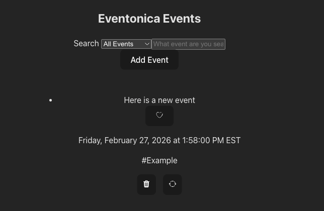

# Eventonica Project with PostgreSQL Database

This project demonstrates an Event Management Web App connecting a React + Vite frontend, Express + Node.js backend, and a PostgreSQL database. This project has five routes that implements the CRUD framework.




## How to run

1. Clone [trivia-game](https://github.com/darithedev/eventonica)

### Database

2. Run command `createdb -T template0 eventonica`
3. Run command `psql -d eventonica < eventonica_db.sql`

### Backend

4. Run command ```cd backend```
5. Run command ```npm install```
6. Run command ```npm run dev``` to run your backend server
7. On your browser, go to ```localhost:8080/``` 

### Frontend

8. Run command ```cd frontend```
9. Run command ```npm install```
10. Run command ```npm run dev``` to run your frontend server
11. On your browser, go to ```localhost:5173/``` 

Congratulations your servers are now running

## API Endpoints

| Method | Endpoint | Description | Request Body |
|--------|----------|-------------|--------------|
| GET | `/` | Get healthy message | `{ "Express server is healthy. Postgres database connection is healthy." }` |
| GET | `/api/events` | Get all events  | ``{ ... }`` |
| POST | `/api/event/:id` | Create a new event | `{ ... }` |
| PUT | `/api/event/:id` | Update an event | `{ ... }` |
| PATCH | `/api/event/:id` | Toggle favorite/un-favorite for an event | `{ ... }` |
| DELETE | `/api/event/:id` | Remove event from database | `{ ... }` |

## Testing

#### Using [Postman](https://learning.postman.com/docs/getting-started/overview/)

1. **Server and Database Health**
   - Method: `GET`
   - URL: `http://localhost:8080/`

2. **Retrieve all events**
   - Method: `GET`
   - URL: `http://localhost:8080/api/events`

3. **Create new event**
   - Method: `POST`
   - URL: `http://localhost:8080/api/event`
   - Body/JSON: 
   {
      "event_name": "React Workshop",
      "category": "Education",
      "date": "2026-03-15T15:00:00.000Z",
      "is_favorite": false
    } 

4. **Update an event**
   - Method: `PUT`
   - URL: `http://localhost:8080/api/event/3`
   - Body/JSON: 
   {
      "id": 3,
      "event_name": "React Workshop 2",
      "category": "Education",
      "date": "2026-03-20T15:00:00.000Z",
      "is_favorite": false
    } 
  

5. **Update favorite/un-favorite for an event**
   - Method: `PATCH`
   - URL: `http://localhost:8080/api/event/3`
   - Body/JSON:
   {
      "is_favorite": true
    } 

6. **Remove an event**
   - Method: `DELETE`
   - URL: `http://localhost:8080/api/event/3`

 
#### Using cURL (add `|  jq` at the end to make json "prettier")

1. **All events**
   - `curl http://localhost:8080/api/events`

2. **New Event**
  ```
curl -X POST http://localhost:8080/api/event \
-H "Content-Type: application/json" \
-d '{
   "event_name": "React Workshop",
   "category": "Education",
   "date": "2026-03-15T15:00:00.000Z",
   "is_favorite": false
}'`
```

3. **Edit event**
 ```curl -X PUT http://localhost:8080/api/event/3 \
-H "Content-Type: application/json" \
-d '{
   "event_name": "React Workshop 2",
   "category": "Education",
   "date": "2026-03-20T15:00:00.000Z",
   "is_favorite": false
}'
```

4. **Toggle favorite / un-favorite**
```
curl -X PATCH http://localhost:8080/api/event/3 \
-H "Content-Type: application/json" \
-d '{
  "favorite": true
}'
```

5. **Delete Event**
  - curl -X DELETE http://localhost:8080/api/event/3

### Secondary / Strech Goals

- [ ] Add route for user profile pages
- [ ] Add auth routes for login and account creation